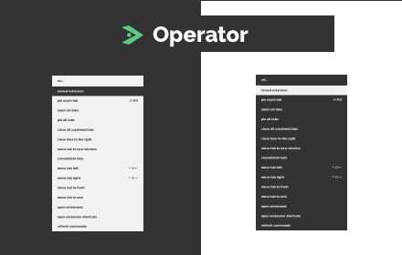

# Operator

Keyboard driven workflows for managing tabs.

[Download From Chrome Webstore](https://chrome.google.com/webstore/detail/operator/jdmngaaglkkhkfegaopojolefpnikcpg)

## Getting Started

1. Install the Extension to Chrome or Edge

2. Open the Extension, by using the hotkey (control + space) or clicking extension icon in the top right corner

3. Search and execute a command

## Default Shortcuts (MacOS)

- `Ctrl+Space` - open runner dialogue
- `Cmd+Shift+X` - pin/unpin current tab
- `Ctrl+Shift+Left` - move tab left
- `Ctrl+Shift+Left` - move tab right

## Commands

- `pin unpin tab`
- `unpin all tabs`
- `pin all tabs`
- `close all unpinned tabs`
- `close tabs to the right`
- `move current tab to new window`
- `collect all tabs into one window`
- `move tab highlighted tabs left`
- `move tab highlighted tabs right`
- `move tab highlighted tabs to start`
- `move tab highlighted tabs to end`
- `open extension manager`
- `open extension shortcuts manager`

[Command configuration in code](./src/commands/commands.ts)

To find the shortcuts for your platform see the `"commands"` in [Shortcut configuration in code](./config/manifest.json)

## Shortcut Configuration

If you have the extension installed.

1. From chrome, `Ctrl+Space` to open extension
2. Search `shortcuts`
3. Press Enter or click on option
4. A native browser page will show up where shortcuts can be managed.

Note: The extension can only preset 4 shortcuts, but more can be configured by the end-user [Read More](https://newbedev.com/google-chrome-maximum-of-4-chrome-commands-allowed)

## Contributing

To get the environment set up locally see [Contributing](./docs/contributing/getting-started.md)
